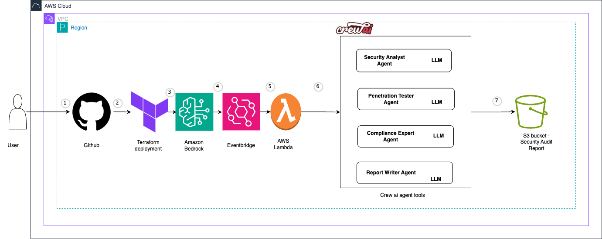

# AWS Infrastructure Security Audit And Reporting Crew

Welcome to the AWS Infrastructure Security Audit And Reporting Crew project, powered by [CrewAI](https://crewai.com). This project is designed to help you perform security audits and generate reports for your AWS infrastructure using a multi-agent AI system, leveraging the powerful and flexible framework provided by CrewAI.

[](https://opensource.org/licenses/MIT)

## Architecture Overview



The AWS Security Auditor Crew architecture combines CrewAI's multi-agent framework with AWS services to provide comprehensive security auditing capabilities. The system can be deployed locally or to AWS using Terraform, with Amazon Bedrock powering the AI agents.

## CrewAI + AWS Bedrock

CrewAI, a Python-based open-source framework, simplifies the creation and management of multi-agent systems, enabling agents to work together seamlessly, tackling complex tasks through collaborative intelligence. This project leverages Amazon Bedrock to power the AI agents with Claude 3 Sonnet.

## Get Started

### Python Version Requirements

CrewAI requires Python >=3.10 and <3.13. Here's how to check your version:

```bash
python3 --version
```

If you need to update Python, visit [python.org/downloads](https://python.org/downloads)

### Installing CrewAI

1. Install CrewAI with all recommended tools using either method:

```bash
pip install 'crewai[tools]'
```
or
```bash
pip install crewai crewai-tools
```

2. For existing installations, upgrade CrewAI:

```bash
pip install --upgrade crewai crewai-tools
```

If you see a Poetry-related warning, migrate to the new dependency manager:
```bash
crewai update
```

3. Verify your installation:

```bash
pip freeze | grep crewai
```

### Project Setup

1. Clone this repository
2. Set up your environment variables (see Environment Variables section below)
3. Install dependencies with:
    ```bash
    crewai install
    ```

### Terraform Deployment (Optional)

This project includes Terraform configurations to deploy the security audit system to AWS:

1. Navigate to the `terraform` directory:
   ```bash
   cd terraform
   ```

2. Follow the instructions in the terraform directory's README.md to deploy:
   - Create a `terraform.tfvars` file from the example
   - Initialize Terraform with `terraform init`
   - Deploy with `terraform apply`

The Terraform deployment creates:
- Lambda function to run the CrewAI application
- S3 buckets for code and reports
- IAM roles with appropriate permissions
- CloudWatch logging
- Scheduled execution via EventBridge

### Environment Variables

A `.env.example` file is provided in the root directory as a template. Copy this file to create your own `.env` file:

```bash
cp .env.example .env
```

For local development, you can use AWS CLI credentials:

```bash
aws configure
```

When deployed to AWS, the application will use IAM roles for authentication, so no credentials are needed in the `.env` file.

The following variables are required:

```env
# AWS Region for Bedrock
AWS_REGION_NAME=us-east-1
MODEL=bedrock/anthropic.claude-3-sonnet-20240229-v1:0
SERPER_API_KEY=your_serper_api_key # Serper API key for research (optional)
```

> **Security Note**: Never commit your actual `.env` file to version control. The `.env` file is already included in `.gitignore` to prevent accidental commits of sensitive information.

### AWS Bedrock Setup
1. Ensure you have access to AWS Bedrock in your AWS account
2. Your AWS credentials must have permissions to invoke Bedrock models
3. The specified AWS region must have Bedrock available
4. The model specified in `MODEL` must be enabled in your Bedrock console

### Supported Models
- See [AWS Bedrock documentation](https://docs.aws.amazon.com/bedrock/latest/userguide/model-ids-arns.html) for more models

### Configuration Files
- Modify `src/aws_infrastructure_security_audit_and_reporting/config/agents.yaml` to define your agents
- Modify `src/aws_infrastructure_security_audit_and_reporting/config/tasks.yaml` to define your tasks
- Modify `src/aws_infrastructure_security_audit_and_reporting/crew.py` to add your own logic, tools and specific args
- Modify `src/aws_infrastructure_security_audit_and_reporting/main.py` to add custom inputs for your agents and tasks

## Running the Project

To start your crew of AI agents and begin the AWS security audit, run this from the root folder of your project:

```bash
crewai run
```

This command initializes the AWS Infrastructure Security Audit crew, assembling the agents and assigning them tasks as defined in your configuration.

This example, unmodified, will run the create a `report.md` file with the output of a research on LLMs in the root folder.

## Understanding Your Crew

The AWS Infrastructure Security Audit crew is composed of multiple AI agents, each with unique roles, goals, and tools:

1. **Security Analyst Agent**: Collects and analyzes AWS resource information
2. **Penetration Tester Agent**: Identifies vulnerabilities in AWS resources
3. **Compliance Expert Agent**: Checks configurations against compliance standards
4. **Report Writer Agent**: Compiles findings into comprehensive reports

These agents collaborate on a series of tasks, defined in `config/tasks.yaml`, leveraging their collective skills to perform security audits and generate comprehensive reports. The `config/agents.yaml` file outlines the capabilities and configurations of each agent in your crew.

## AWS Resources Audited

The security audit examines various AWS resources, including:

- **EC2 Instances**: Security groups, patches, configurations
- **S3 Buckets**: Permissions, encryption, public access settings
- **IAM**: Roles, policies, permissions, password policies
- **VPC Configuration**: Network ACLs, security groups, routing
- **RDS Databases**: Encryption, backup policies, access controls
- **Lambda Functions**: Permissions, environment variables, runtime settings
- **CloudFront Distributions**: HTTPS settings, origin access
- **Other AWS Services**: Based on what's deployed in your environment

## Data Flow Overview

This document outlines the data flow within the AWS Infrastructure Security Audit and Reporting Crew system, detailing how information moves between components and services.

## User Interaction and Initialization

- Users initialize the security audit process by running `crewai run` from the command line
- Environment variables from the `.env` file are loaded, providing AWS credentials and configuration settings
- The CrewAI framework assembles the agent crew based on configurations in `config/agents.yaml`

## Agent Initialization and Task Assignment

- The main application (`src/aws_infrastructure_security_audit_and_reporting/main.py`) initializes the crew
- Agent configurations are loaded from YAML files, creating specialized AI agents with defined roles
- Tasks are assigned to agents according to the workflow defined in `config/tasks.yaml`
- Amazon Bedrock (Claude 3 Sonnet) powers the AI agents through the CrewAI framework

## AWS Resource Data Collection

- The Security Analyst Agent connects to AWS services using provided credentials
- AWS API calls are made to collect information about deployed resources:
  - EC2 instances and security groups
  - S3 buckets and their configurations
  - IAM roles, policies, and permissions
  - VPC configurations and network settings
  - RDS databases and their security settings
  - Lambda functions and their configurations
  - Other AWS services as defined in the audit scope
- Collected data is processed and structured for analysis

## Security Analysis Processing

- The Security Analyst Agent examines collected AWS resource data for security issues
- The Penetration Tester Agent identifies potential vulnerabilities in the AWS infrastructure
- The Compliance Expert Agent compares configurations against security standards and best practices
- Analysis results are shared between agents through the CrewAI framework's collaborative mechanisms
- Findings are categorized by severity and compliance impact

## Report Generation

- The Report Writer Agent compiles findings from all other agents
- Security issues are organized by service, severity, and compliance impact
- Remediation recommendations are generated for each identified issue
- A comprehensive security audit report is created in markdown format
- The report is saved as `report.md` in the project root directory

## Terraform Deployment Flow (Optional)

When deployed using Terraform:
- The Lambda function is triggered according to the EventBridge schedule
- The CrewAI application runs within the Lambda environment
- AWS credentials are provided through IAM roles
- Generated reports are stored in the designated S3 bucket
- CloudWatch logs capture the execution details and any errors

## Data Storage and Persistence

- Security findings and reports are stored in:
  - Local filesystem when run locally
  - S3 buckets when deployed to AWS via Terraform
- Historical reports can be accessed for compliance tracking and security posture improvement
- Sensitive AWS configuration data is processed in memory and not persisted beyond the audit

## Integration with External Tools

- The Serper API is used by agents for research on security best practices
- Results from external research are incorporated into the security analysis
- Findings can be exported in formats compatible with other security tools

## Security recommendation on checkov findings

1. **CKV_AWS_116**: Ensure Lambda function is configured for a Dead Letter Queue (DLQ)
   - *Recommendation*: Configure a Dead Letter Queue for the Lambda function to capture failed executions
2. **CKV_AWS_272**: Ensure AWS Lambda function is configured to validate code-signing
   - *Recommendation*: Implement code signing for Lambda functions to ensure only trusted code is deployed
3. **CKV_AWS_300**: Ensure S3 lifecycle configuration sets period for aborting failed uploads
   - *Recommendation*: Add abort incomplete multipart upload configuration to all S3 bucket lifecycle rules
4. **CKV2_AWS_62**: Ensure S3 buckets have event notifications enabled
   - *Recommendation*: Configure event notifications for audit_reports_replica bucket
6. **CKV2_AWS_11**: Ensure VPC flow logging is enabled in all VPCs
    - *Recommendation*: Enable VPC flow logs for network monitoring and security analysis
7. **CKV_AWS_337**: Ensure SSM parameters are using KMS CMK
    - *Recommendation*: This repository uses AWS KMS keys for encryption, it is suggested to use a customer-managed KMS key
8. **CKV_AWS_355**: IAM policy allows "*" as a resource for restrictable actions 
   - *Recommendation**: Wildcard resource is necessary for these Bedrock list/get operations as they don't support resource-level permissions. This follows AWS best practices for these specific API calls.


## Support

For support, questions, or feedback:
- Visit the [CrewAI documentation](https://docs.crewai.com)
- Check out the [CrewAI GitHub repository](https://github.com/CrewAIInc/crewAI)
- [Join our Forum](https://community.crewai.com)
- [Chat with the docs](https://chatg.pt/DWjSBZn)
- See our [SUPPORT.md](SUPPORT.md) file for more options

## License

This project is licensed under the MIT License - see the [LICENSE](LICENSE) file for details.

Let's create wonders together with the power and simplicity of crewAI.
